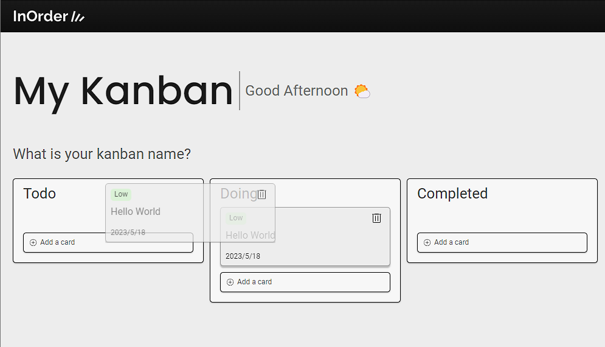
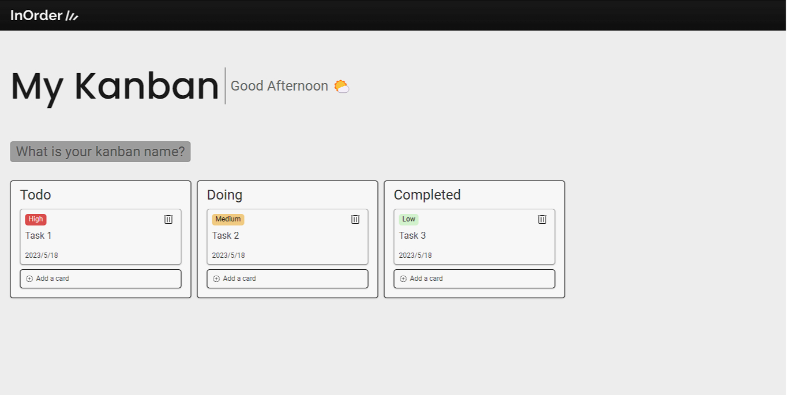

<div align="center">
  
</div>
<br>
<br>

<p align="center">
  <a href="#about-project">About Project</a> · 
  <a href="#built-with">Built with</a> · 
  <a href="#main-features">Main Features</a> · 
  <a href="#ui">UI</a> ·
  <a href="#final-thoughts">Final Thoughts</a>
  
</p>

## About Project

"In-Order" is a simple task manager where you can easily organize and streamline your routine. You can add or remove tasks, set their priority, and move them between "To Do", "Doing", and "Completed" categories. It offers a minimalist interface, making it easy to use and ensuring faster task management.

## Built with

- JavaScript
- ES6 Modules
- Pure JavaScript Components ✨
- HTML & CSS
- Drag-and-Drop API
- LocalStorage

## Main Features

### Drag-and-drop



Thanks to the drag-and-drop API, all manipulation between kanbans is much easier and intuitive. You can organize all your tasks simply by clicking and dragging them to each kanban.

### Pure JavaScript Components ✨

```javascript
export function createCardComponent({
  title,
  date,
  priorityClass,
  priorityName,
}) {
  const card = `
  <div draggable="true" data-drag="item"> 
    <div class="card-header">
    <span class="card-status ${priorityClass}">${priorityName}</span>
    <button data-dropdown="open-btn">
      
      <ul data-dropdown="content">
        <li>
          <a href="#" data-dropdown="trash-btn">Remove card</a>
        </li>
        <li>
          <a href="#">Cancel</a>
        </li>
      </ul>
    </button>
    </div>
    <p>${title}</p>
    <span>${date}</span> 
  </div>`;
  return card;
}
```
I confess that this was the most interesting part of the project. Working with component manipulation makes the project much faster and independent of direct DOM manipulation. It allows all data to be stored in a slightly more complex but highly scalable manner.

### LocalStorage

```javascript
const kanbanData = {
  toDoCards: [{}],
  pendingCards: [{}],
  doneCards: [{}],
}
```
With the localStorage implemented in the project, it allows the user to not lose all their task progress and keep everything stored within their browser or mobile device. It is automatically rendered and updated based on actions such as adding/removing or even moving tasks.

### UI



The project's UI was entirely designed in Figma, where I aimed for a minimalist and cozy style. I sought to achieve user focus and objectivity by emphasizing the project's main functionalities. Additionally, I added a personalized touch to make each kanban unique for every user.

### Final thoughts

This was one of the projects where I had the opportunity to develop something from design to code entirely on my own. One of the main challenges 

I faced during the development process was working with pure JavaScript components. It was quite a challenge, but in the end, it was rewarding and beneficial for the project. I could see the performance and agility that comes with working with components. 

Although it was a bit sad to move away from direct DOM manipulation, it pushed me out of my comfort zone and allowed me to build something much more scalable and fast.

Overall, this project was a great way for me to improve my skills, learn new technologies, and apply that knowledge to practical projects like this one and others on <a href="https://github.com/adriel-mp3">my Github 🤙</a>

